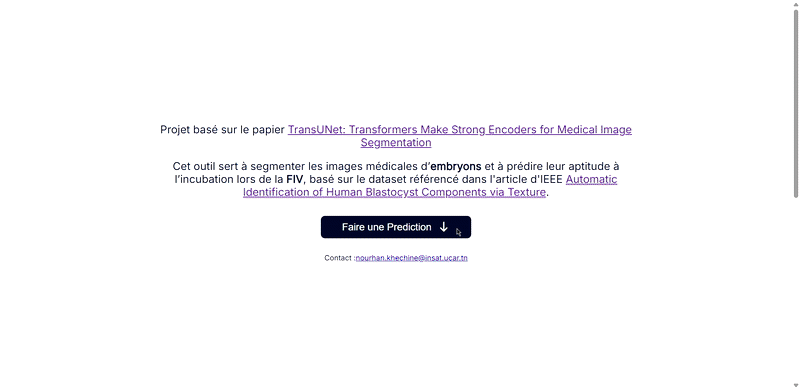

# Multi-Task TRANSU-Net: Segmentation & Classification

This project implements a **multi-task TransUNet** model for segmentation and classification of human embryo images.  
It integrates the model into a **full-stack application** with a *React* frontend and a *FastAPI* backend.

References:

- **TransUNet: Transformers Make Strong Encoders for Medical Image Segmentation**  
  [ArXiv link](https://arxiv.org/abs/2102.04306)

- **Automatic Identification of Human Blastocyst Components via Texture** (IEEE)  
  [IEEE link](https://ieeexplore.ieee.org/document/8059868)

---

## Project Structure

- **Frontend:** `ui/` in *React*.  
- **Training:** `model/` contains preprocessing, model training, metrics, and callbacks.  
- **Backend API:** `app.py` exposes a *FastAPI* endpoint for predictions where images preprocessing is in `test.py`.  
- **Dependencies:** listed in `requirements.txt`.  

---

## Demo

Example of the model in action:

