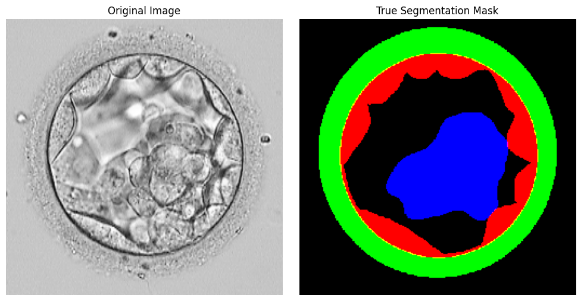

# Project Overview

This project implements a **multi-task TRANSU-Net** model for:

- **Segmentation** of embryo images into *Zona Pellucida (ZP)*, *Inner Cell Mass (ICM)*, and *Trophectoderm (TE)* regions.  
- **Binary classification** based on embryo outcome.

**Ground Truth masks** example for segmentation:



---

### Dataset and Masterlist

The dataset consists of embryo images and corresponding segmentation masks.

- **Images:** Stored as `.bmp` files in `train/images`, `valid/images`, and `test/images`.

- **Masks:** Binary masks, one per class:
  - **TE** → Trophectoderm
  - **ZP** → Zona Pellucida
  - **ICM** → Inner Cell Mass  
    Stored in `GT_TE`, `GT_ZP`, `GT_ICM` folders under each split.

**Data Augmentation:**
- Augmented images have already been generated and included in the dataset.
- Augmentation pipeline is based on the preprocessing notebook: [preprocessing.ipynb](https://github.com/nourhen369/Embryo-Image-Segmentation/blob/main/notebooks/preprocessing.ipynb).

**Masterlist (`MasterlistAug30-2017.xlsx`)** contains the outcome of each embryo:

| Column      | Description                   |
|-------------|-------------------------------|
| `File Name` | Name of the embryo image file |
| `Outcome`   | Implantation outcome          |

**Outcome values:**

- `0` → Not implanted
- `1` → Implanted
- `2` → Unknown

**Notes:**

- Only images with outcome `0` or `1` are used for training and validation.
- Images with outcome `2` are skipped.


Used this [dataset](https://ieeexplore.ieee.org/document/8059868) from:
> Automatic Identification of Human Blastocyst Components via Texture,  
> IEEE Transactions on Biomedical Engineering.

---

The dataset pipeline:

1. Reads images and masks using `dataset.py`.
2. Filters images with valid outcomes (0 or 1).
3. Handles class imbalance using `sampler.py` by undersampling of majority class.
4. Creates TensorFlow datasets with `tf_dataset_multi_with_cls`.

---

## Training Pipeline

1. **K-Fold Cross-Validation (5 folds)**.
2. **Model**: TRANSU-Net with:
   - Segmentation head (Dice loss)
   - Classification head (Binary Cross-Entropy)
3. **Optimizer**: Adam, learning rate `1e-4`.
4. **Callbacks**:
   - ReduceLROnPlateau
   - EarlyStopping with restore_best_weights
5. **Metrics**:
   - Segmentation: Dice coefficient, IoU
   - Classification: Accuracy, AUPRC, Precision, Recall

---

## Model Evaluation

**Per-Fold Results from 5-Fold CV**

| Fold | Loss  | Seg Loss | Dice | IoU  | Cls Loss | Cls Accuracy | Cls AUPRC | Cls Precision | Cls Recall |
|------|-------|----------|------|------|----------|--------------|-----------|---------------|------------|
| 1    | 1.766 | 0.186    | 0.618| 0.684| 0.612    | 0.660        | 0.608     | 0.814         | 0.713      |
| 2    | 1.868 | 0.254    | 0.643| 0.632| 0.774    | 0.698        | 0.587     | 0.746         | 0.639      |
| 3    | 1.887 | 0.202    | 0.657| 0.693| 0.577    | 0.675        | 0.551     | 0.798         | 0.690      |
| 4    | 1.937 | 0.264    | 0.668| 0.605| 0.685    | 0.638        | 0.688     | 0.736         | 0.607      |
| 5    | 0.988 | 0.118    | 0.882| 0.798| 0.336    | 0.861        | 0.941     | 0.859         | 0.866      |

**Mean (5 folds)**:

- **Loss**: 1.689  
- **Seg Loss**: 0.205  
- **Dice**: 0.694  
- **IoU**: 0.682  
- **Cls Loss**: 0.597  
- **Cls Accuracy**: 0.704  
- **Cls AUPRC**: 0.725  
- **Cls Precision**: 0.782  
- **Cls Recall**: 0.703  

**Observations:**

- Early stopping prevented overfitting, restoring weights from the best epoch per fold.
- Segmentation Dice and IoU show stable performance across folds.
- Classification metrics improve with undersampling of majority class.

---

## Challenges Encountered

1. **Multi-task training (Segmentation + Classification)**  
   - Balancing tasks: We chose to weight the classification loss higher than segmentation (2.5 vs 1.0), though dynamic weighting strategies like gradual loss could be explored.

2. **Overfitting on classification**  
   - High train accuracy but low validation performance due to limited dataset size.  
   - Solutions: learning rate tuning, early stopping, regularization, and cross-validation.

3. **Image preprocessing and quality**  
   - Variability in image size and brightness.  
   - Preprocessing and normalization pipeline implemented for consistent input.

4. **Limited dataset**  
   - Few annotated examples for certain classes.  
   - Solutions: undersampling and data augmentation.

5. **High training time**  
   - GPU-intensiveee.  
   - Solutions: appropriate batch size, early stopping, and automatic learning rate reduction.

---

## How to Run Trainer

```bash
# Change config.yaml witj your actual dataset paths
# Create your virtual environment
python -m venv myenv

# Activate it
myenv\Scripts\activate

# Install dependencies
pip install -r .\requirements.txt

# Run trainer
python -m model.train
```
---

## How to read TensorBoard logs

```bash
tensorboard --logdir=model/logs/TensorBoard